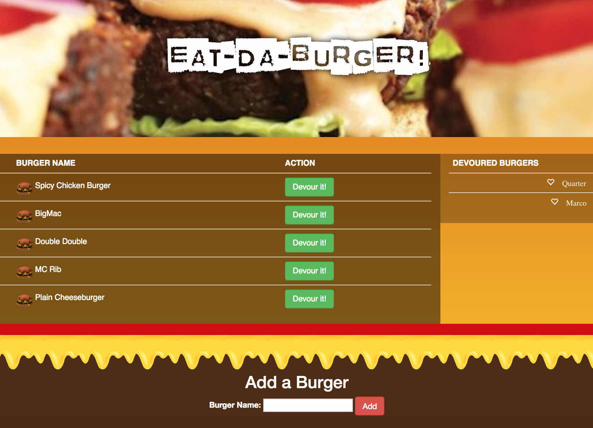

# Burger
a burger logger with MySQL, Node, Express, Handlebars and a homemade ORM. Following the MVC design pattern; we use Node and MySQL to query and route data in our app, and Handlebars to generate our HTML.

